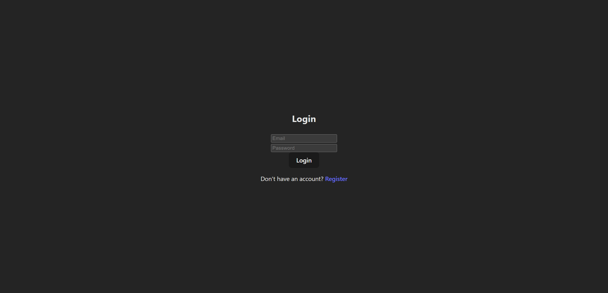
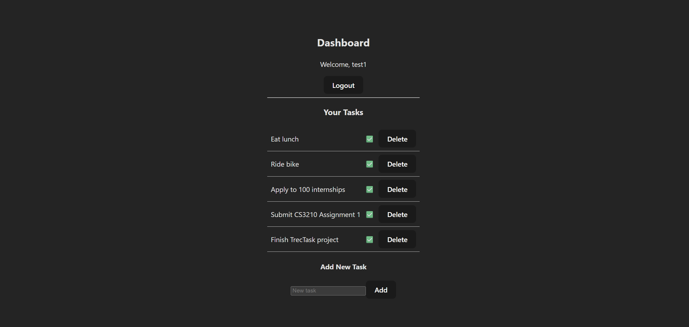

# TrecTask

A full-stack task management application built with React, Spring Boot, and PostgreSQL.

---

## Overview

This application allows users to register, log in, and manage personal tasks. 
Users can create, toggle, and delete tasks, with all data persisted in a PostgreSQL database.

This project demonstrates full-stack development, REST API design, and relational database integration.

---

## Tech Stack

### Frontend
- React
- Axios
- React Router

### Backend
- Spring Boot
- Spring Data JPA (Hibernate)
- RESTful APIs

### Database
- PostgreSQL

### Tools
- Maven
- npm

---

## Features

- User authentication (login/register)
- Create tasks
- Toggle task status (NEW / DONE)
- Delete tasks
- Pagination support
- Persistent storage using PostgreSQL
- RESTful API architecture

---

## Architecture

The backend follows a layered architecture:

Controller → Service → Repository → Database

The frontend communicates with the backend using REST APIs.

---

## How to Run

### Backend

1. Navigate to the backend directory
2. Run:
``` 
mvn spring-boot:run
```
The backend will start on:
http://localhost:8080

### Frontend

1. Navigate to the frontend directory
2. Install dependencies:
``` 
npm install
```
3. Start the development server:
```
npm start
```
The frontend will start on:
http://localhost:3000

---

## Key Learnings

- Designing RESTful APIs
- Managing entity relationships with JPA
- Handling asynchronous frontend requests
- Debugging full-stack integration issues
- Implementing CRUD operations end-to-end

---

## Future Improvements

- Task filtering (All / Completed / Pending)
- Task editing
- Improved UI styling
- Authentication using JWT tokens
- Deployment to cloud platforms

---

## Screenshots



